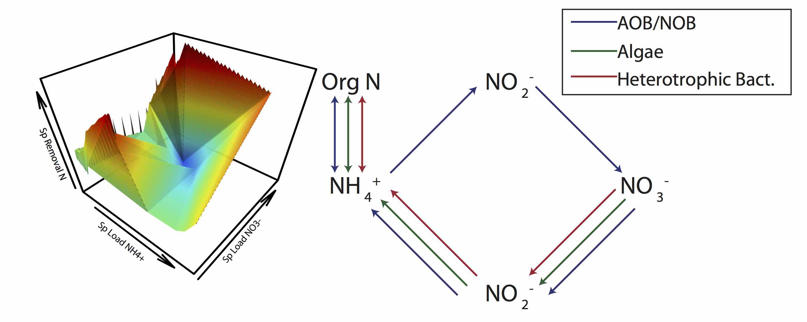

Algal-based biotechnologies have the potential to provide many beneficial products and services for an increasingly populated and energy demanding planet. Algal biomass can be used as feedstock for biofuel production, supplement livestock feed, sequester carbon dioxide in our atmostphere, and be used to recover nutrients from waste streams. Two of the major challenges this biotechnology faces are difficulties in culturing high density algae biomass, which reduces the energy (read: cost) needed for dewatering prior to downstream processes, and fully understanding the interactions between organisms in natural ecosystems, which may help us to properly design the physical, chemical, and ecological components of built systems to maximize the stability of production and reduce/minimize the number of crashes that occur. My research focuses on addressing these challenges. 

We've successfully developed and adapted a [high density bioreactor](/pages/HDBR.md) which allows the cultivation of highly dense biomass for a number of different mixed communities, including algae. As you can see from the picture below, these efforts have been highly successfull. We hope to continue to expand upon this research and improve upon the design. 

{:height="50%" width="50%"}   

We've also investigated the chemical behavior/kinetics and microbial community composition within these reactors in an effort to establish causal connections between them. 

{:height="50%" width="50%"}    

For more information on the reactors used in my algae research visit the HDBR page [here](/pages/HDBR.md).  

If you'd like to learn more about my algae research, please review Price et. al. 2015 and Price et. al. 2016 on my [publications](../2-publications.md) page.
___  
[back to main research page](../1-research.md)  