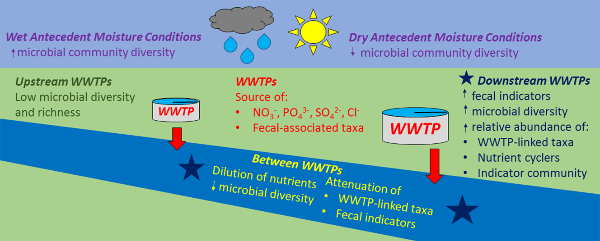

It would be difficult to overstate the number of ways that human activity impacts freshwater bodies. For example, urbanization is almost synonomous with increases in impervious surface cover, resulting in increased runoff decreases in watershed response time. Even seeminly benign activities, such as landscaping or farming can greatly increase nutrient fluxes into and through streams, rivers, and lakes resulting in eutrophication and the degradation of water quality downstream. 

I'm interested in how anthropogenic activities impact and change the physical, chemical, and biological aspects of freshwater bodies. In particular I focus, or would like to focus on the effects of fertilizer application, domesticated animal waste (pets and livestock), and physical structures such as impervious surface cover and BMPs (retention/detention ponds). 

{:height="50%" width="50%"}    

If you'd like to learn more about this project, please review Price et. al. 2018 on my [publications](../2-publications.md) page.  

___  
[back to main research page](../1-research.md)  